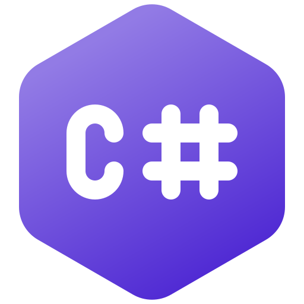
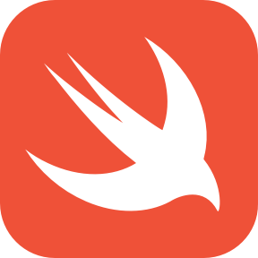

### Hi there 👋🏻

I'm Berke, a recent graduate software engineer specializing in mobile app development with iOS and game development with Unity Engine.

### 🕹️Game Portfolio: [https://berkeparildar.github.io/Games/](https://berkeparildar.github.io/Games/)
### 📱App Portfolio: [https://berkeparildar.github.io/Apps/](https://berkeparildar.github.io/Apps/)

### Programming languages I use: 

### Technologies
- SwiftUI and Flutter for mobile development 📱 
- Unity Engine for game development 🕹️
- ASP.Net Core and Node.js for backend development 💽
- Angular for web development 🕸️
- Git for version control system 🎛️
- Jetbrains Toolchain ⚙️
- Visual Studio Toolchain ⚙️
